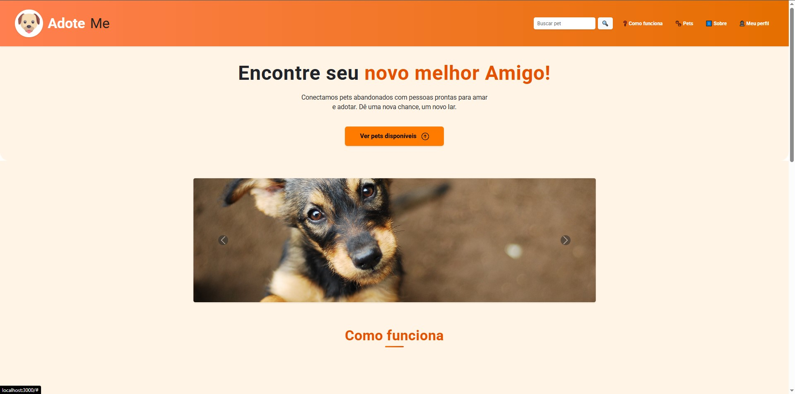

# Introdução

Informações básicas do projeto.

* **Projeto:** Adote.ME
* **Repositório GitHub:** https://github.com/ICEI-PUC-Minas-CC-TI/ti1-2025-1-t2-manha-adoteme
* **Membros da equipe:**
  * [Gabriel Mendonça Almeida Magalhães](https://github.com/)
  * [Matheus Gouvêa Ramalho](https://github.com/matheussgr) 
  * [Pedro Augusto Gomes de Araújo](https://github.com/PedroAugustoPucMG) 

A documentação do projeto é estruturada da seguinte forma:

1. Introdução
2. Contexto
3. Product Discovery
4. Product Design
5. Metodologia
6. Solução
7. Referências Bibliográficas


# Contexto

Detalhes sobre o espaço de problema, os objetivos do projeto, sua justificativa e público-alvo.

## Problema


A adoção de animais no Brasil enfrenta diversos obstáculos que dificultam o processo tanto para os adotantes quanto para as instituições envolvidas. Atualmente, não existe uma plataforma centralizada e confiável que reúna informações atualizadas sobre pets disponíveis para adoção, abrigos, ONGs e protetores independentes.

Essa fragmentação de informações dificulta o acesso dos interessados, que muitas vezes desistem da adoção por não saberem por onde começar ou por se depararem com processos burocráticos, pouco intuitivos e, em alguns casos, excludentes.

Além disso, muitos adotantes não têm clareza sobre os custos e responsabilidades envolvidos no cuidado com um animal, o que pode gerar abandonos futuros. 

Nesse cenário, surge a necessidade de uma solução digital que promova a aproximação entre adotantes e instituições, desburocratize o processo e forneça informações relevantes e educativas sobre adoção responsável.

## Objetivos


* Objetivo Geral:
Desenvolver uma plataforma digital que facilite e incentive a adoção responsável de pets, conectando adotantes a abrigos e protetores independentes, de forma acessível, segura e intuitiva.

* Objetivos Específicos:

Centralizar informações de animais disponíveis para adoção e instituições parceiras.

Reduzir a burocracia e simplificar o processo de adoção.


## Justificativa


A escolha por desenvolver esta solução surgiu a partir da identificação de um problema social cada vez mais evidente. No Brasil, o processo de adoção de animais ainda enfrenta muitas barreiras, como a falta de acesso à informação e a burocracia envolvida. Enquanto isso, milhares de animais permanecem em abrigos ou nas ruas, muitas vezes sem visibilidade e com poucas chances de encontrar um lar.

Apesar da existência de ONGs e iniciativas individuais que lutam pela causa animal, ainda falta uma ferramenta eficiente que conecte essas iniciativas à população interessada em adotar. Ao unir tecnologia com responsabilidade social, a plataforma visa preencher essa lacuna, ampliando as possibilidades de adoção e garantindo mais bem-estar aos animais.

A solução proposta tem impacto direto não apenas no bem-estar dos pets, mas também na vida das pessoas, ao proporcionar uma experiência de adoção mais humana, informada e segura.

## Público-Alvo


O público-alvo da plataforma é composto por diferentes perfis:

Pessoas interessadas em adotar: Buscam um meio confiável, prático e seguro para encontrar um novo companheiro.

Voluntários e protetores independentes: Atuam no resgate e cuidado inicial dos animais e precisam de apoio para promover as adoções.

Adotantes já experientes: Que podem compartilhar feedback, ajudar na orientação de novos adotantes e continuar conectados à rede de apoio pós-adoção.

Esses diferentes perfis demonstram a necessidade de uma solução abrangente, inclusiva e colaborativa, capaz de atender a múltiplas demandas dentro de um único ecossistema digital.

# Product Discovery

## Etapa de Entendimento


## Etapa de Definição

### Personas


# Product Design

Nesse momento, vamos transformar os insights e validações obtidos em soluções tangíveis e utilizáveis. Essa fase envolve a definição de uma proposta de valor, detalhando a prioridade de cada ideia e a consequente criação de wireframes, mockups e protótipos de alta fidelidade, que detalham a interface e a experiência do usuário.

## Histórias de Usuários


## Proposta de Valor


## Requisitos

As tabelas que se seguem apresentam os requisitos funcionais e não funcionais que detalham o escopo do projeto.

### Requisitos Funcionais

| ID | Descrição do Requisito | Prioridade |
| --- | --- | --- |
| RF-001 | Permitir o cadastro de usuários (adotantes, protetores e ONGs) | ALTA |
| RF-002 | Permitir o cadastro de pets com informações detalhadas (nome, idade, raça, histórico, fotos) | ALTA |
| RF-003 | Permitir busca de pets | ALTA |
| RF-003 | Permitir gerenciamento das informações do usuário | MÉDIA |
| RF-003 | Permitir gerenciamento das informações dos pets | MÉDIA |
| RF-003 | Permitir a requisão de adoção de um pet | ALTO |
| RF-003 | Permitir aceitar/recusar uma doção, bem como ver os detalhes do usuário interessado | ALTO |
| RF-003 | Permitir ver os detalhes de cada pet | ALTO |


### Requisitos não Funcionais


| ID | Descrição do Requisito | Prioridade |
| --- | --- | --- |
| RNF-001 | O sistema deve ser responsivo e acessível em dispositivos móveis e desktops | ALTA |
| RNF-003 | O sistema deve ser intuitivo e de fácil usabilidade | ALTA |
| RNF-005 | O sistema deve ter tempos de resposta rápidos para todas as funcionalidades principais | MÉDIA |
| RNF-006 | O sistema deve ser escalável para futuras atualizações e melhorias | MÉDIA |
| RNF-007 | O sistema deve utilizar tecnologias modernas para backend e frontend | MÉDIA |


## Projeto de Interface

Artefatos relacionados com a interface e a interacão do usuário na proposta de solução.

### Wireframes

Estes são os protótipos de telas do sistema.


### User Flow


### Protótipo Interativo

https://www.figma.com/proto/9nqgkjLYdcLDgqU3qD0Ys5/TI-1--?node-id=1-1130&p=f&t=zol3TUu77AKOu688-1&scaling=contain&content-scaling=fixed&page-id=0%3A1

# Metodologia

Detalhes sobre a organização do grupo e o ferramental empregado.

## Ferramentas

Relação de ferramentas empregadas pelo grupo durante o projeto.

| Ambiente                    | Plataforma | Link de acesso                                     |
| --------------------------- | ---------- | -------------------------------------------------- |
| Processo de Design Thinking | Miro       | https://www.canva.com/design/DAGjiSz5Dq0/Vdoa-w5IkelpkL5FbgK9zQ/edit?utm_content=DAGjiSz5Dq0&utm_campaign=designshare&utm_medium=link2&utm_source=sharebutton        |
| Repositório de código     | GitHub     | https://github.com/ICEI-PUC-Minas-CC-TI/ti1-2025-1-t2-manha-adoteme.git      |
| Protótipo Interativo       | MarvelApp  | https://www.figma.com/proto/9nqgkjLYdcLDgqU3qD0Ys5/TI-1--?node-id=1-1130&p=f&t=zol3TUu77AKOu688-1&scaling=contain&content-scaling=fixed&page-id=0%3A1   |
| Hospedagem                 |        |                                                    |


## Gerenciamento do Projeto


# Solução Implementada

Esta seção apresenta todos os detalhes da solução criada no projeto.

## Vídeo do Projeto

https://youtu.be/5OgT0Wtr1B4

## Funcionalidades

Esta seção apresenta as funcionalidades da solução.Info

##### Funcionalidade 1 - Cadastro de Pets 

Permite a inclusão, leitura, alteração e exclusão de pets para o sistema

* **Instruções de acesso:**
  * Abra o site e efetue o login
  * Entre no seu perfil
  * Clique em "Meus Pets"
  * Clique em "Registrar um Pet"
* **Tela da funcionalidade**:


##### Funcionalidade 2 - Adoção

Função principal é facilitar a conexão entre pets e futuros adotantes, guiando-os através de um formulário de candidatura e requisitos necessários.

* **Instruções de acesso:**
  * Abra o site e efetue o login
  * Acesse o menu principal e vá na barra de busca
  * Em seguida, escreva o que procura ou utilize os filtros para facilitar sua busca
  * Depois escolha seu Pet e entre na sua página de detalhes
  * Veja os detalhes e solicite uma requisição de adoção
  * Preencha o formulário e o submeta
  * Aguarde a resposta do outro usuário 
* **Tela da funcionalidade**:
  
  
  

##### Funcionalidade 3 - Ferramenta de busca: 

Permite a inserir termos como nome do pet, raça ou palavras-chave. Aciona uma busca textual que pode ser combinada com filtros.

* **Instruções de acesso:**
  * Abra o site e efetue o login
  * Acesse o menu principal e vá na barra de busca
  * Em seguida, escreva o que procura ou utilize os filtros para facilitar sua busca
* **Tela da funcionalidade**:


##### Funcionalidade 4 - Gerenciamento de Perfil

Permite o usuário ver suas inforamções, bem como alterá-las, além de ver o pets cadastros em seu usuário

* **Instruções de acesso:**
  * Abra o site e efetue o login
  * Acesse o menu principal e vá na aba meu perfil
* **Tela da funcionalidade**:


##### Funcionalidade 5 - Home do Site:

Tela inicial que os usuários logados estarão permitidos a ver e utilizar

* **Instruções de acesso:**
  * Abra o site e efetue o login
  * Será direcionado para a Home do nosso site
* **Tela da funcionalidade**:


##### Funcionalidade 6 - Edição das Informações dos Pets:

Permite o usuário a editar os pets cadastrados

* **Instruções de acesso:**
  * Abra o site e efetue o login
  * Vá em Meu Perfil
  * Veja os seus Pets e quilique em editar Pet
  * Edite conforme o desejado
* **Tela da funcionalidade**:


##### Funcionalidade 7 - Login:

Permite o usuário efetuar Login para acessar o site

* **Instruções de acesso:**
  * Abra o site e efetue o login
* **Tela da funcionalidade**:


##### Funcionalidade 8 - Registro de Usuário:

Permite o usuário se registrar para depois efetuar o login e acessaro o site

* **Instruções de acesso:**
  * Abra o site e efetue o login
  * Selecione a opção Registre-se e efetue o registro de usuário
* **Tela da funcionalidade**:


##### Funcionalidade 9 - Página de Detalhes dos Pets:

Permite o usuário analisar os detalhes dos Pets para depois efetuar a solicitação de adoção

* **Instruções de acesso:**
  * Abra o site e efetue o login
  * Em seguida, escreva o que procura ou utilize os filtros para facilitar sua busca
  * Depois escolha seu Pet e entre na sua página de detalhes
* **Tela da funcionalidade**:


##### Funcionalidade 10 - Cards Pets Home:

Permite o usuário ver alguns Pets disponíveis na Home

* **Instruções de acesso:**
  * Abra o site e efetue o login
  * Em seguida, na Home irá aparecer alguns Pets disponíveis
* **Tela da funcionalidade**:


##### Funcionalidade 11 - Página Minhas adoções:

Permite o usuário ver os Pets solicitados e os que foram requisitados para serem adotados

* **Instruções de acesso:**
  * Abra o site e efetue o login
  * Em seguida, na Home, apertar o botão Minhas Adoções
  * Poderá ver todas as solicitações feitas e recebidas
* **Tela da funcionalidade**:


## Estruturas de Dados

Descrição das estruturas de dados utilizadas na solução com exemplos no formato JSON.Info

##### Estrutura de Dados - Pets   

Pets da aplicação

```json
    {
      "id": 1,
      "nome": "Pipoca",
      "especie": "Cachorro",
      "raca": "Border Collie",
      "idade": "5",
      "sexo": "Fêmea",
      "porte": "Médio",
      "peso": "18",
      "vacinado": "Sim",
      "vermifugado": "Não",
      "castrado": "Sim",
      "condicao": "Nenhuma",
      "temperamento": "Dócil",
      "criancas": "Sim",
      "outrosPets": "Sim",
      "localizacao": "Rua Montanha Branca, 89",
      "imagem": "https://petfisio.com.br/wp-content/uploads/2019/07/bordercollie3.jpg",
      "descricao": "Dócil e inteligente, ideal para famílias ativas.",
      "ownerId": 1
    }
  
```

##### Estrutura de Dados - Meu Perfil 

Usuários da aplicação

```json
    "usuarios": 
    {
      "id": 1,
      "senha": "senha123",
      "nome": "Pedro Augusto",
      "email": "joao@email.com",
      "endereco": "Rua das Flores, 123",
      "celular": "(31) 98765-4321",
      "cpf": "123.456.789-00",
      "login": "joao123",
      "fotoPerfil": "https://images.pexels.com/photos/60778/pexels-photo-60778.jpeg?auto=compress&cs=tinysrgb&w=1260&h=750&dpr=1",
      "petIDs": [
        1,
        2,
        11,
        12
      ]
    
  }
```


## Módulos e APIs

Esta seção apresenta os módulos e APIs utilizados na solução

**Fonts:**

* Icons Font Face - [https://fontawesome.com/](https://fontawesome.com/) 

**Scripts:**

* jQuery - [http://www.jquery.com/](http://www.jquery.com/) 
* Bootstrap 4 - [http://getbootstrap.com/](http://getbootstrap.com/) 

# Referências

* https://www.adotepetz.com.br/
* https://www.amigonaosecompra.com.br/
* https://flammo.com.br/blog/persona-e-publico-alvo-qual-a-diferenca/
* https://resultadosdigitais.com.br/blog/persona-o-que-e/
* https://rockcontent.com/blog/personas/
* https://blog.hotmart.com/pt-br/como-criar-persona-negocio/
* https://www.atlassian.com/br/agile/project-management/user-stories
* https://medium.com/vertice/como-escrever-boas-users-stories-hist%C3%B3rias-de-usu%C3%A1rios-b29c75043fac
* https://codificar.com.br/requisitos-funcionais-nao-funcionais/
